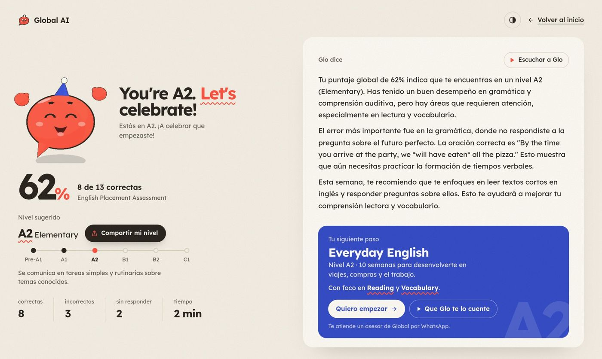
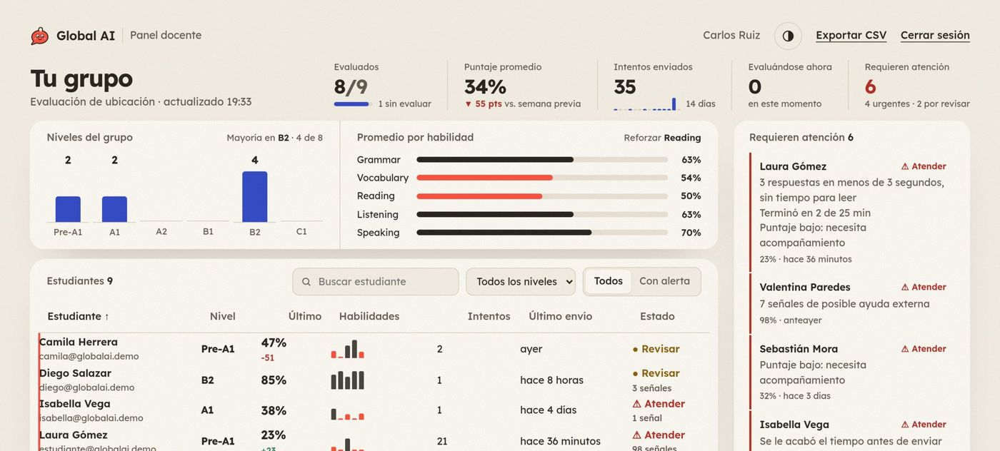

# Global AI · Mini English Assessment

Evaluación de nivel de inglés con **Glo**, un coach con voz que acompaña al estudiante. Incluye 10 preguntas + 3 de Speaking, calificación en el servidor, nivel MCER (Pre-A1 → C1), feedback con IA, recomendación de curso y panel para profesores.


**Documentos de la entrega**

- [Decisiones técnicas (2 páginas)](docs/Decisiones-Tecnicas-GlobalAI.pdf): arquitectura, seguridad, escalabilidad y respuestas a las preguntas de la entrevista.
- [Anexo visual del producto](docs/Anexo-Producto-Glo.pdf): recorrido con capturas y detalle de cada decisión.

---

## Probarlo en tu computador (unos 10 minutos)

No hace falta saber programar. Solo necesitas instalar un programa (Docker), descargar el proyecto y escribir **un comando**. Docker prepara todo lo demás: la base de datos, el servidor y la página web.

### Paso 1 · Instalar Docker

1. Descarga **Docker Desktop** desde <https://www.docker.com/products/docker-desktop/> y elige tu sistema:
   - **Windows:** si el instalador pregunta por *WSL 2*, deja esa opción marcada. Puede pedir reiniciar el equipo.
   - **Mac:** elige *Apple Silicon* (M1, M2, M3, M4) o *Intel* según tu equipo. Si no sabes cuál tienes: menú de la manzana → *Acerca de este Mac*.
   - **Linux:** sigue la guía de tu distribución en <https://docs.docker.com/engine/install/>.
2. **Abre Docker Desktop** y espera a que diga *Engine running* (o a que la ballena de la barra superior deje de moverse). Tiene que quedar abierto mientras usas el proyecto.

### Paso 2 · Descargar el proyecto

Elige **una** de estas dos opciones:

- **Sin Git (más fácil):** en <https://github.com/Jhongdlp/GlobalAI> pulsa el botón verde **Code → Download ZIP** y descomprime el archivo, por ejemplo en el Escritorio.
- **Con Git:**
  ```bash
  git clone https://github.com/Jhongdlp/GlobalAI.git
  ```

### Paso 3 · Abrir una terminal dentro de la carpeta

- **Windows:** abre la carpeta `GlobalAI` en el Explorador, haz clic en la barra de direcciones, escribe `cmd` y pulsa Enter.
- **Mac:** abre la app **Terminal**, escribe `cd ` (con un espacio al final), arrastra la carpeta `GlobalAI` a la ventana y pulsa Enter.
- **Linux:** clic derecho dentro de la carpeta → *Abrir en una terminal*.

### Paso 4 · Encender todo con un comando

Copia y pega esto en la terminal y pulsa Enter:

```bash
docker compose up --build
```

- **La primera vez tarda entre 3 y 6 minutos**, porque descarga e instala todo. Las siguientes veces arranca en segundos.
- Van a aparecer muchas líneas de texto. Es normal.
- **Está listo** cuando veas una línea parecida a `Uvicorn running on http://0.0.0.0:8000`.
- No cierres esa ventana: si la cierras, el proyecto se apaga.

### Paso 5 · Abrir la aplicación

Abre el navegador (Chrome, Edge, Firefox o Safari) en:

### <http://localhost:8080>

Entra con una de estas cuentas de prueba. Atajo: marca la casilla de *Términos y Privacidad* y pulsa **Estudiante** o **Profesor** debajo del formulario; Glo escribe los datos por ti.

| Rol | Correo | Contraseña |
|---|---|---|
| Estudiante | `estudiante@globalai.demo` | `Demo1234!` |
| Profesor | `profesor@globalai.demo` | `Demo1234!` |

La primera vez que entres con cada cuenta tendrás que marcar la casilla de *Términos y Privacidad*.

### Qué probar

**Como estudiante**

1. En el inicio verás tu nivel y tu progreso. Pulsa **Comenzar evaluación** (o **Repetir evaluación** si ya la hiciste).
2. Responde las preguntas. Puedes usar el ratón o el teclado (letras A–D y Enter). Todo se guarda solo: si recargas la página o se va el internet, no pierdes nada.
3. Al terminar verás tu **nivel MCER**, el desglose por habilidad, el comentario de Glo y el **curso recomendado**.
4. De vuelta en el inicio, prueba **Practicar pronunciación**: una mini clase con Glo (necesita las llaves de voz, ver más abajo).

**Como profesor**

- Verás el panel del grupo: niveles, promedios por habilidad, estudiantes que **requieren atención** y exportación a CSV.



### Apagar o reiniciar

| Quiero… | Qué hacer |
|---|---|
| Apagarlo | En la terminal, pulsa **Ctrl + C** (en Mac también **Ctrl + C**). |
| Volver a encenderlo | `docker compose up` (ya no hace falta `--build`, salvo que cambie el código). |
| Borrar los datos y empezar de cero | `docker compose down -v` y luego `docker compose up --build`. |

---

## Opcional · Activar la IA y la voz de Glo

**Sin configurar nada, todo funciona:**

- El comentario de Glo usa una plantilla en vez de IA.
- Glo no habla en voz alta.
- Las 3 preguntas orales se pueden saltar; el resto de la evaluación se califica igual.

Para activar la IA y la voz:

1. Dentro de la carpeta `apps/api`, haz una copia del archivo `.env.example` y llámala `.env`.
2. Ábrela con cualquier editor de texto (Bloc de notas, TextEdit) y completa las llaves que tengas:

   ```env
   # IA: elige UNA opción cambiando AI_PROVIDER
   AI_PROVIDER=anthropic          # anthropic (Claude) | openai | mock
   ANTHROPIC_API_KEY=tu-llave-de-anthropic
   # o bien:
   # AI_PROVIDER=openai
   # OPENAI_API_KEY=tu-llave-de-openai

   # Voz de Glo y calificación de Speaking (ElevenLabs)
   TTS_PROVIDER=elevenlabs
   STT_PROVIDER=elevenlabs
   ELEVENLABS_API_KEY=tu-llave-de-elevenlabs
   ```

3. Apaga (Ctrl + C) y vuelve a encender con `docker compose up`.

> **Cambiar de IA es cambiar un solo campo** (`AI_PROVIDER`) en este archivo, sin tocar código. Con `AI_PROVIDER=openai` y `OPENAI_BASE_URL` también funciona con cualquier servicio compatible con OpenAI (Groq, OpenRouter, Ollama, Gemini).

El archivo `.env` es privado: nunca se sube al repositorio.

---

## Problemas frecuentes

| Veo esto… | Solución |
|---|---|
| `Cannot connect to the Docker daemon` o `docker: command not found` | Docker Desktop no está abierto o no terminó de instalarse. Ábrelo, espera a *Engine running* y repite el comando. |
| `port is already allocated` / `address already in use` | Otro programa usa el puerto 8080, 8000 o 5433. Ciérralo, o cambia el número de la izquierda en `docker-compose.yml` (por ejemplo `"8081:80"`) y abre <http://localhost:8081>. |
| La página no carga | Espera a ver `Uvicorn running…` en la terminal y recarga. Asegúrate de usar **http** (no https) y el puerto **8080**. |
| En Windows falla con un mensaje sobre *WSL* | Abre *PowerShell como administrador*, ejecuta `wsl --update`, reinicia y vuelve a abrir Docker Desktop. |
| El micrófono no funciona | Cuando el navegador lo pregunte, pulsa **Permitir**. Además, las preguntas orales necesitan la llave de ElevenLabs (ver arriba). |
| Algo quedó raro y quiero empezar limpio | `docker compose down -v` y después `docker compose up --build`. |

---

## Para desarrolladores

### Estructura

```
apps/
  api/   FastAPI + SQLAlchemy 2 (async) + PostgreSQL · Alembic · pytest
  web/   Astro + TypeScript · Three.js (Glo) · service worker offline
docs/    Decisiones técnicas y anexo (PDF)
```

- La API sigue capas simples: `api/` (rutas y permisos) → `services/` (casos de uso) → `domain/` (reglas puras: calificación, speaking, cursos).
- La web llama a `/api/v1/...` en el **mismo origen**. En local lo reenvía el proxy de Vite; en Docker, nginx. Así la cookie `httpOnly` funciona sin CORS.

### Levantarlo sin Docker (modo desarrollo)

Requisitos: Python 3.12 con [uv](https://docs.astral.sh/uv/), Node 22 y PostgreSQL (o solo la base con Docker: `docker compose up db`, que escucha en el puerto 5433).

```bash
# API → http://localhost:8000/docs (Swagger)
cd apps/api
cp .env.example .env    # si usas `docker compose up db`, cambia el puerto a 5433 en DATABASE_URL
uv sync
uv run alembic upgrade head
uv run python -m seed.seed
uv run uvicorn app.main:app --reload

# Web → http://localhost:4321 (en otra terminal)
cd apps/web
npm install
npm run dev
```

### Tests y calidad

```bash
cd apps/api
uv run pytest -q          # 68 tests contra PostgreSQL real
uv run ruff check . && uv run ruff format --check .
```

Los tests usan la base `globalai_test`, que debe existir en el mismo servidor. CI (GitHub Actions) ejecuta lint + tests con Postgres 17, compila la web, levanta todo con `docker compose` como prueba de humo y publica la imagen de la API en GHCR.

### Puertos

| Servicio | Docker | Desarrollo |
|---|---|---|
| Web | <http://localhost:8080> | <http://localhost:4321> |
| API + Swagger | <http://localhost:8000/docs> | <http://localhost:8000/docs> |
| PostgreSQL | `localhost:5433` | el tuyo |


